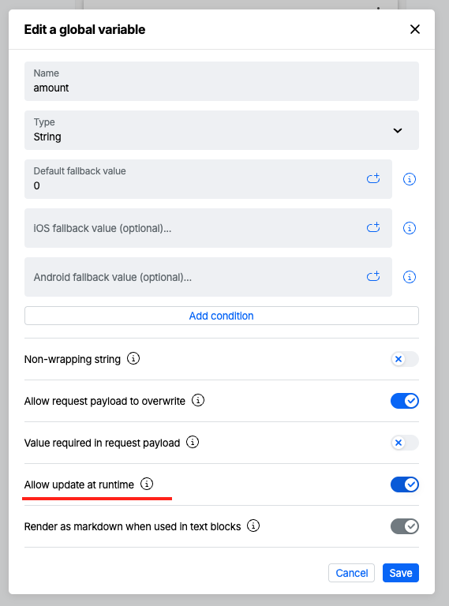

# SwiftUI Boilerplate App
This is a boilerplate app that can be forked to get you started with the Atomic SwiftUI SDK.

The code is based around the [Atomic SwiftUI SDK documentation](https://documentation.atomic.io/sdks/ios-swiftui) and designed to get you up and running as quickly as possible, not necessarily as best practice.

This boilerplate is provided for demonstration and onboarding purposes only. It is not production-ready, and we do not recommend submitting it, or any modified version of it, to the App Store or using it in a production environment without your own review, testing, and hardening. You are responsible for any changes you make and for how you use this project. Atomic is not liable for any losses, damages, or issues that arise from using this boilerplate or any modifications derived from it.

## Quick Start

1. Install the latest stable version of Xcode. This project currently targets Xcode 26.4.1 (17E202).
2. Open `SwiftUI boilerplate/SwiftUI boilerplate.xcodeproj`.
3. In Xcode, choose File > Packages > Update to Latest Package Versions to resolve the Atomic SwiftUI SDK package.
4. For production apps, follow the official [Atomic SwiftUI SDK installation guide](https://documentation.atomic.io/sdks/ios-swiftui#installation) instead of copying this sample setup directly.

### SDK configuration
The app requires your Atomic Workbench settings before it can run. Add the following values to `AtomicSettings` in `SwiftUI boilerplate/SwiftUI boilerplate/SwiftUI_boilerplateApp.swift`:

- Open [Atomic Workbench](https://workbench.atomic.io/) and go to Configuration.
- `environmentId`: shown at the top of the page under Environment ID.
- `apiKey`: listed in SDK API Keys.
- `apiBaseUrl`: listed in SDK API Host.
- `containerId`: listed in Stream containers.

Return a valid JSON Web Token (JWT) from `TheSessionDelegate.cardSessionDidRequestAuthenticationToken()`. See [SDK Authentication](https://documentation.atomic.io/sdks/auth-SDK) for JWT generation details.

## Runtime variables
This branch demonstrates how runtime variables are resolved. A runtime variable `amount` has been set up in `ContentView.swift`, which has a value of 500.

To test this feature:

- In [Atomic Workbench](https://workbench.atomic.io/), in "Action Flows", open an action flow.
- In the "Variables" section, create a variable called "amount", and make sure "Allow update at runtime" is turned on.
- Add this variable to a card.
- Publish the card and run this app.

